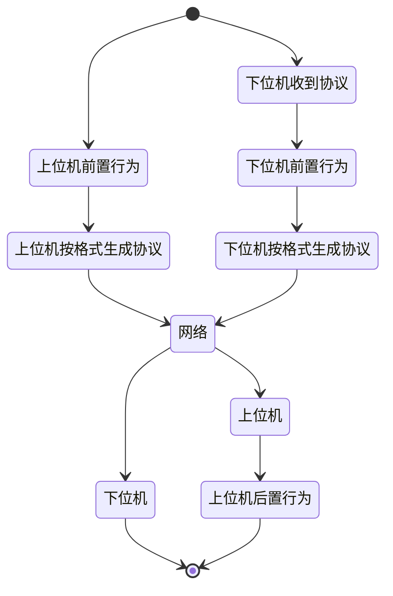
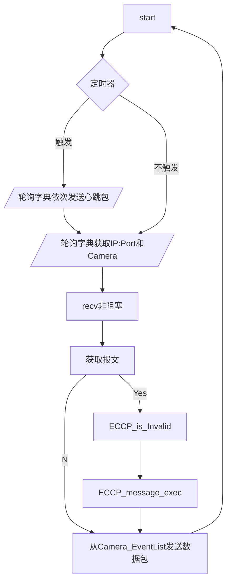

# 基于TCP的嵌入式相机控制协议

- Embedded camera control protocol

## 协议包含的内容

报文长度
报文功能码
报文数据

## 协议传输的方式

同步通讯：上位机发送功能，下位机对应执行该功能的过程，并在完成后返回。
异步通讯：由某上位机发送特定的功能后，下位机持续的发送某设定功能的过程。

也就是说上位机发送的一定要收到回复，下位机发送的不需要回复。

每次通讯的行为模式可以简化成：



<div align = "center">图1-1：通讯行为模式图</div>

## 报文功能码

`0x0`:相机接入

主机：非法
从机：向服务器发送接入请求

从机发送的信息格式：

| 相机ID  |
| ------- |
| 32*char |
| 出厂ID  |

主机的行为：

记录接入的时间，同时开始以`主机心跳包发送间隔==一个时间间隔`发送心跳包

`0x1`：心跳包
主机：发送时间
从机：返回设定后时间

主机的行为：

检验生存时间，超时则删除这个相机，否则，发送心跳包

主机发送的信息格式：

| 时间     |
| -------- |
| clock_t  |
| unix时间 |

从机返回的信息格式：

| 时间     |
| -------- |
| clock_t  |
| unix时间 |

主机的行为：

收到心跳包（或任何的包）后，更新相机的生存时间

`0x2`：获取相机详细数据
主机：无数据
从机：相机详细数据

主机的行为：

前置从数据库确认出厂ID

从机返回的信息格式：

| width        | height     |
| ------------ | ---------- |
| unsigned int | int        |
| 照片的宽度   | 照片的高度 |

`0x3`：照相
主机：无数据
从机：拍照，发送24位RGB数据

主机的行为：

从字典确认相机存在

从机返回的信息格式：

| 照片号             | 数据包标号     | 数据长                  | 数据块 |
| ------------------ | -------------- | ----------------------- | ------ |
| clock_t            | unsigned short | short                   | string |
| 第一个包的发送时间 | 从0开始        | 至多**<u>8192</u>**字节 | BGR    |

`0x4`：开启从机定时发送
主机：发送定时器时间
从机：无数据响应，开始按定时器时间间隔拍照返回

主机的行为：
从字典确认相机存在

| 时间间隔 |
| -------- |
| int      |
| 单位：秒 |

`0x5`：从机定时传输数据
主机：非法
从机：拍照，发送24位RGB数据

`0x6`：结束从机定时发送
主机：无数据
从机：无数据

## 协议的格式

3字节+动态容量（完整的报文至多8192字节）

1字节：报文功能码
2字节：报文长度
动态：报文内容

## 服务端和客户端的API设计

基于UDP
上位机使用C做底层，Python做接口的设计，优先实现Linux环境。

#### 0、上位机Python接口设计

```Python
#module name: eccp
class Camera:
    pic_list = []
    
    def get_ID(self) -> str: ...

    def get_filePath(self) -> str: ...

    def set_filePath(self, filePath: str) -> bool: ...

    def getPic(self) -> None: ...

    def startPicStream(self, interval: int) -> None: ...

    def finishPicStream(self) -> None: ...

listen_dict = {}
#这里保存Camera列表，exec会轮询这个列表中的Camera元素以接收并存储照片
def exec(IP_address: str, port: int, maxnb: int, callback) -> None: ...
#这里的callback用作接入后的操作，形如def func(var:Camera) -> None
```

#### -1、（CPython API层面）设计

```c
typedef struct PyCameraObject
{
    PyObject_HEAD
	Camera_info info;
    EventList event;
}PyCameraObject
    
PyDictObject listen_dict;//k:v long long（sockaddr_in）/PyCameraObject

//PyCamera_Type 内封装的函数
PyObject* wrong_alloc(); //通过报异常来封掉构造、形成工厂模式
PyObject* get_ID(PyCameraObject*);
PyObject* get_filePath(PyCameraObject*);
PyObject* set_filePath(PyCameraObject*,PyObject** args);

PyObject* getPic(PyCameraObject*);
PyObject* startPicStream(PyCameraObject*,PyObject**args);
PyObject* finishPicStream(PyCameraObject*);

//会调用List轮询各socket
PyObject* exec(PyModuleObject* module,PyObject** args);
```

在`exec`函数中应当具有这样的循环：




#### -2、（C层面）功能码函数

这一层旨在实现服务器端解析功能码后要执行的函数，也即处在 图1-1 **上位机后置行为**中，具体函数的名称无实际意义，但格式上要遵循：

```C
//data为后续的数据
//length为数据长度
//camera为对应的相机
int func(const char* data,unsigned short length,Camera_info* camera)
{
	if(success)
        return 0;
    else
        return some_other_number;
}
```


#### -3、（C层面）协议解析

```C
typedef struct ECCP_message
{
    const char reserved;
    char func_code;
    unsigned short length;
    char data[];
}ECCP_message;

typedef int (*ECCP_func)(const char* data,unsigned short length,Camera_info* camera);

int ECCP_is_Invalid(ECCP_message* Emsg,int length);
void ECCP_message_exec(ECCP_message*,Camera_info*);
void vec_ECCP_FUNC(unsigned char func_code,ECCP_func* func);
```

#### -4、（C层面）相机信息结构体

```C
typedef struct Camera_info
{
	char filepath[256];
	char ID[32];//这个需要设计成为定长 COMPANY-yyyy-mm-dd-hh-mm-ss-8B_number-防伪标识位（模运算）
	int width;
	int height;
} camera_info
    
int Camera_save_picture(Camera_info* camera,clock_t time,const char* data);
```
